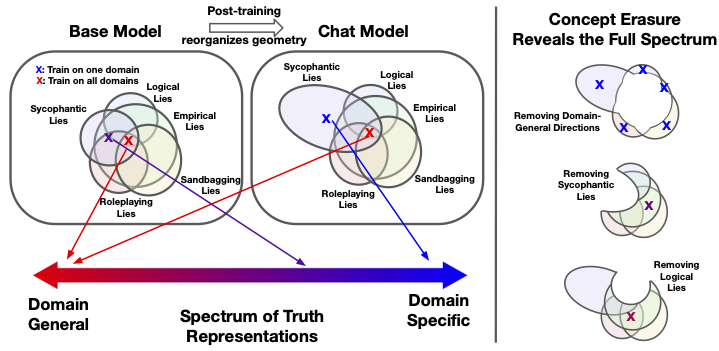

# The Truthfulness Spectrum Hypothesis

**Zhuofan Josh Ying, Shauli Ravfogel, Nikolaus Kriegeskorte, Peter Hase**

This repo contains code for the paper: The Truthfulness Spectrum Hypothesis

[[Paper link]](https://arxiv.org/abs/2602.20273)

<p align="center">
  
</p>

---

## Setup

Create and activate conda environment:
```bash
conda create -n truth_spec python=3.12
conda activate truth_spec
```
Install the dependencies with:
```bash
pip install -r requirements.txt
```

## Usage

### Datasets

To create the sycophancy dataset for a new model:
```bash
python scripts/sycophancy_dataset.py all --model llama-70b-3.3
```

### Extract Activations

```bash
python extract_feats.py --model llama-70b-3.3 --layers sparse
```

### Train & Test Probes

```bash
cd scripts
./train_test_probes_main.sh
```

This shell script calls `train_test_probes.py`.

### Analysis
See the following scripts and notebooks for various analysis:

**Concept erasure experiments:**
- Stratified INLP: [scripts/stratified_inlp.py](scripts/stratified_inlp.py)
- LEACE: [scripts/leace.py](scripts/leace.py)

**Probe geometry analysis** (Mahalanobis cosine similarity):
- [scripts/geometric_analysis.ipynb](scripts/geometric_analysis.ipynb)

**Causal experiments:**
- [scripts/causal.py](scripts/causal.py)

## Acknowledgement
This codebase is based on [this repo](https://github.com/ApolloResearch/deception-detection). 

## Citation

```bibtex
@misc{ying2026truth,
      title={The Truthfulness Spectrum Hypothesis}, 
      author={Zhuofan Ying and Shauli Ravfogel and Nikolaus Kriegeskorte and Peter Hase},
      year={2026},
      eprint={2602.20273},
      archivePrefix={arXiv},
      primaryClass={cs.LG},
      url={https://arxiv.org/abs/2602.20273}, 
}
```